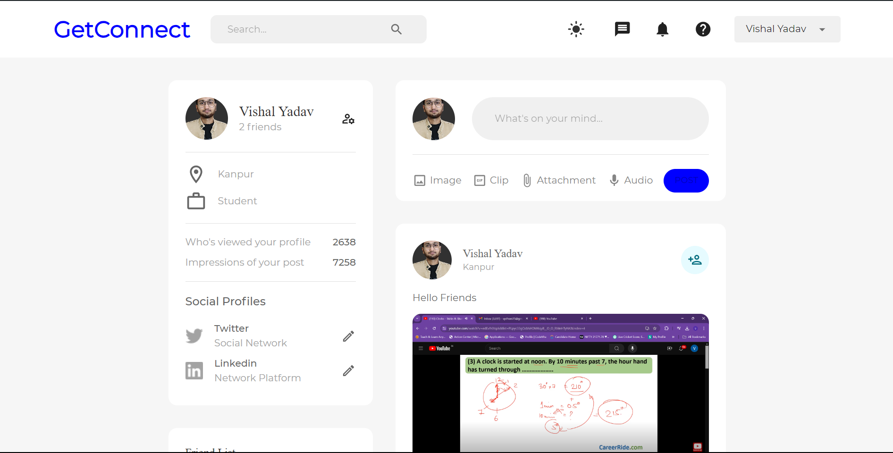

# GetConnect
GetConnect is a full-stack social media platform built using the MERN (MongoDB, Express, React, Node.js) stack. 
This application allows users to connect, share updates, and engage with content through posts, comments, and likes.

## Interfaces

